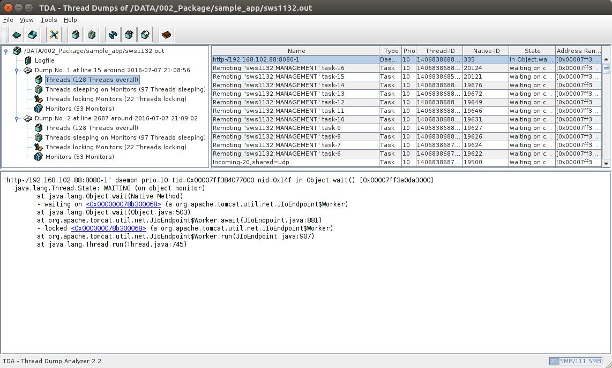

#12. Trouble Shooting

##Trouble Shooting
Thread Stack 및 Heap 분석을 통하여 문제의 근본적인 원인 진단

서비스 문제 유형
 - Memory leck
 - 잘못 된 로직
 - JVM Bug 등등

※ 장애 시 Thread Stack 및 Heap  뿐 만 아니라 OS 및 WAS의 상태를 확인하여 장애를 파악

##Thread Dump란?

JVM에서 Dump 획득 시 사용하고 있는 Thread call stack 정보

##Thread Dump 획득 절차
1. APP 지연 확인
2. 5~10초 간격으로 kill -3 PID 로 3~5번 이상 수행
3. Thread Dump 비교 분석


##Labs12_01 Thread Dump 생성

###jboss의 PID 확인
```
[root@localhost bin]# ps -ef | grep jboss

root     18703 18552  0 Jul06 ?        00:05:59 /usr/lib/jvm/java-1.7.0/bin/java -D[Standalone] -XX:+UseCompressedOops 
-server -Xms512m -Xmx2048m -Xss256k -XX:+UseG1GC -XX:MaxGCPauseMillis=1000 -verbose:gc -XX:+PrintGCTimeStamps 
-XX:+PrintGCDetails -XX:+PrintHeapAtGC -Xloggc:/JBOSS/domains/sws1132/log/gclog/gc_20160706_215605.log 
-XX:-HeapDumpOnOutOfMemoryError -XX:HeapDumpPath=/JBOSS/domains/sws1132/log/gclog/java_pid.hprof 
-XX:+ExplicitGCInvokesConcurrent -Djava.net.preferIPv4Stack=true -Dorg.jboss.resolver.warning=true 
-Dsun.rmi.dgc.client.gcInterval=3600000 -Dsun.rmi.dgc.server.gcInterval=3600000 -Djboss.modules.system.pkgs=org.jboss.byteman 
-Djava.awt.headless=true -Djboss.node.name=sws1132 -Djboss.server.base.dir=/JBOSS/domains/sws1132 -Djboss.server.log.dir=/JBOSS/domains/sws1132/log 
-Djboss.socket.binding.port-offset=0 -Djboss.bind.address.management=192.168.102.88 -Djboss.bind.address=192.168.102.88 -Djboss.bind_addr=230.1.0.1 
-Djboss.default.multicast.address=230.1.0.1 -Djboss.default.multicast.port=55200 -Dserver.mode=local -Djboss.default.jgroups.stack=udp -Dorg.jboss.as.logging.per
-deployment=false -Dorg.jboss.boot.log.file=/JBOSS/domains/sws1132/log/server.log -Dlogging.configuration=file:/JBOSS/domains/sws1132/configuration/logging.properties 
-jar /JBOSS/jboss-eap-6.4/jboss-modules.jar -mp /JBOSS/jboss-eap-6.4/modules:/JBOSS/jboss-eap-6.4/modules.ext -jaxpmodule javax.xml.jaxp-provider org.jboss.as.standalone 
-Djboss.home.dir=/JBOSS/jboss-eap-6.4 -Djboss.server.base.dir=/JBOSS/domains/sws1132 -DSERVER=sws1132 -P=/JBOSS/domains/sws1132/bin/env.properties -c standalone-ha.xml
```

###5~10초 간격으로 3번 수행
```
[root@localhost bin]# kill -3 18703
[root@localhost bin]# kill -3 18703
[root@localhost bin]# kill -3 18703
```

###획득한 Thread Dump는 JBoss 의 nohup log에서 확인
```
Full thread dump OpenJDK 64-Bit Server VM (24.65-b04 mixed mode):
"http-/192.168.102.88:8080-1" daemon prio=10 tid=0x00007ff384077000 nid=0x14f in Object.wait() [0x00007ff3a0da3000]
   java.lang.Thread.State: WAITING (on object monitor)
        at java.lang.Object.wait(Native Method)
        - waiting on <0x000000078b300068> (a org.apache.tomcat.util.net.JIoEndpoint$Worker)
        at java.lang.Object.wait(Object.java:503)
        at org.apache.tomcat.util.net.JIoEndpoint$Worker.await(JIoEndpoint.java:881)
        - locked <0x000000078b300068> (a org.apache.tomcat.util.net.JIoEndpoint$Worker)
        at org.apache.tomcat.util.net.JIoEndpoint$Worker.run(JIoEndpoint.java:907)
        at java.lang.Thread.run(Thread.java:745)

```

##Heap Dump란?
java에서 사용하는 object들을 저장하는 공간으로 현재 Heap에 점유 되고 있는 객체들을 확인 하기 위해 생성

###heap Dump 획득 절차
1. APP 지연 확인
2. GC log 나 모니터링 툴을 이용하여 Full GC 발생 확인
3. Java 에서 제공 하는 jmap 을 이용하여 생성
	jmap –dump:format=b,file=$dump경로/파일명.hprof <pid>


##Labs12_02 Heap Dump 생성

###jboss의 PID 확인
```
[root@localhost bin]# ps -ef | grep jboss

root     18703 18552  0 Jul06 ?        00:05:59 /usr/lib/jvm/java-1.7.0/bin/java -D[Standalone] -XX:+UseCompressedOops 
-server -Xms512m -Xmx2048m -Xss256k -XX:+UseG1GC -XX:MaxGCPauseMillis=1000 -verbose:gc -XX:+PrintGCTimeStamps 
-XX:+PrintGCDetails -XX:+PrintHeapAtGC -Xloggc:/JBOSS/domains/sws1132/log/gclog/gc_20160706_215605.log 
-XX:-HeapDumpOnOutOfMemoryError -XX:HeapDumpPath=/JBOSS/domains/sws1132/log/gclog/java_pid.hprof 
-XX:+ExplicitGCInvokesConcurrent -Djava.net.preferIPv4Stack=true -Dorg.jboss.resolver.warning=true 
-Dsun.rmi.dgc.client.gcInterval=3600000 -Dsun.rmi.dgc.server.gcInterval=3600000 -Djboss.modules.system.pkgs=org.jboss.byteman 
-Djava.awt.headless=true -Djboss.node.name=sws1132 -Djboss.server.base.dir=/JBOSS/domains/sws1132 -Djboss.server.log.dir=/JBOSS/domains/sws1132/log 
-Djboss.socket.binding.port-offset=0 -Djboss.bind.address.management=192.168.102.88 -Djboss.bind.address=192.168.102.88 -Djboss.bind_addr=230.1.0.1 
-Djboss.default.multicast.address=230.1.0.1 -Djboss.default.multicast.port=55200 -Dserver.mode=local -Djboss.default.jgroups.stack=udp -Dorg.jboss.as.logging.per
-deployment=false -Dorg.jboss.boot.log.file=/JBOSS/domains/sws1132/log/server.log -Dlogging.configuration=file:/JBOSS/domains/sws1132/configuration/logging.properties 
-jar /JBOSS/jboss-eap-6.4/jboss-modules.jar -mp /JBOSS/jboss-eap-6.4/modules:/JBOSS/jboss-eap-6.4/modules.ext -jaxpmodule javax.xml.jaxp-provider org.jboss.as.standalone 
-Djboss.home.dir=/JBOSS/jboss-eap-6.4 -Djboss.server.base.dir=/JBOSS/domains/sws1132 -DSERVER=sws1132 -P=/JBOSS/domains/sws1132/bin/env.properties -c standalone-ha.xml
```
```
[root@localhost bin]# jmap -dump:format=b,file=heap.hprof 18703

Dumping heap to /JBOSS/domains/sws1132/bin/heap.hprof ...
Heap dump file created
```

##Analyzer Tools
장애 시 획득한 덤프들은 Analyzer Tools 을 이용하여 분석 한다.

Thread Dump – TDA, IBM JCA등등
Heap Dump – IBM ha, Eclipse Memory Analyzer 등등
Gc log – Hpjmeter, IBM ga

##Labs12_03 Analyzer Tools

Thread Dump를 TDA 를 통해 분석
```
java -jar tda.jar
```



